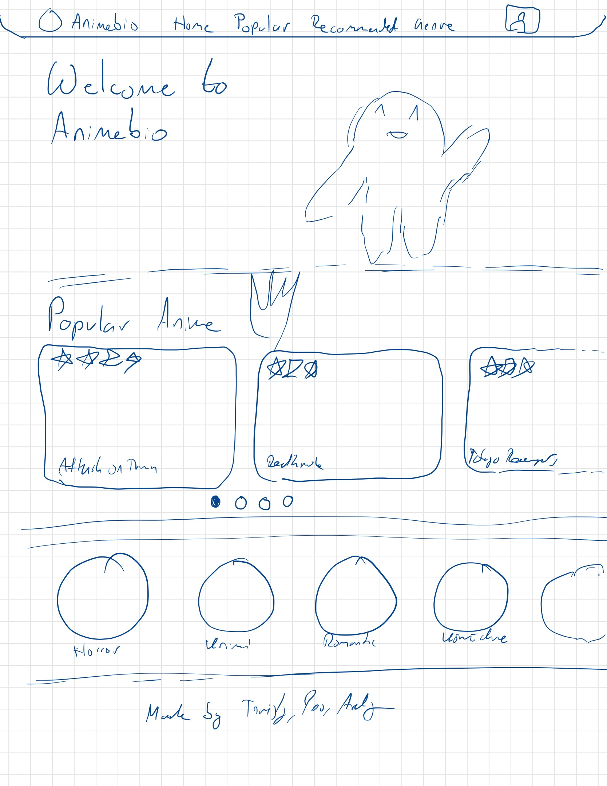
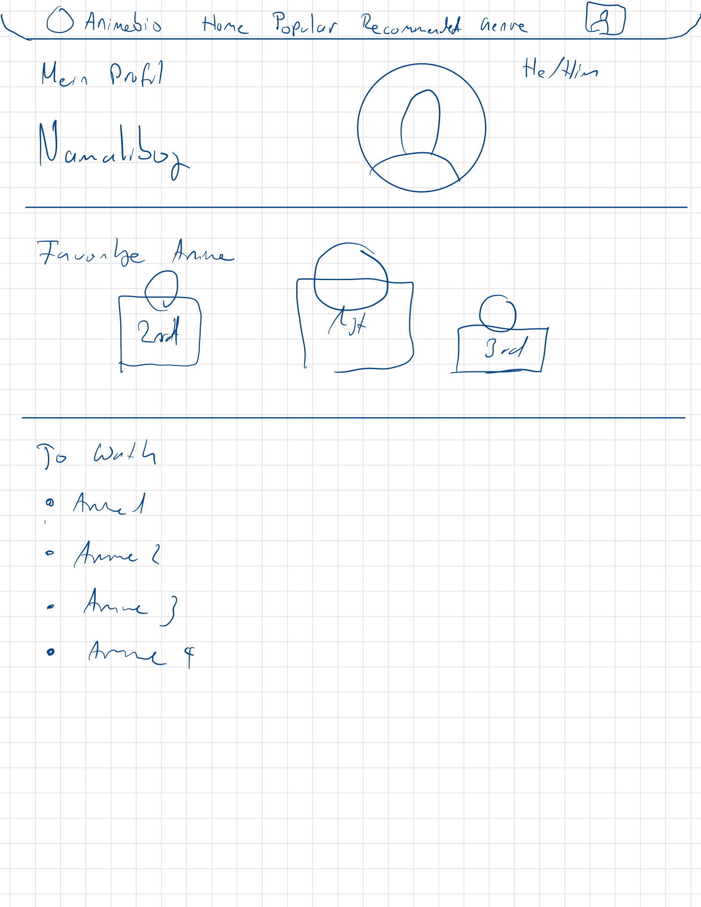

# MyAnimeList - M431 🍉🍭

Schulprojekt umgesetzt mit der Methode IPERKA.

## Vorgehen 🛠

### Informieren 💡

Wir möchten in einem Vue + Java Projekt eine vereinfachte Version von MyAnimeList umsetzen. Man wird sich die beliebtesten Animes ansehen, liken und zu seinem Profil hinzufügen können.

### Planen 📃

Die Webapplikation wird folgende Seiten beinhalten:
Seitenbezeichnung | Beschreibung | Route
| :--- | :--- | :---
Startseite | (Heutige) Top Animes an | /
Userprofil | Infos über sein Profil | /profile/:username
Anime Infos | Detaillierte Angaben über Anime | /anime/:animename

Zudem soll jeder (auch nicht eingeloggte User) die Möglichkeit haben, einen Anime zu "liken". Dies hat einen Einfluss auf den Rank des Animes. Ob man sich ein Userprofil erstellen kann, ist noch in Planung.

|                                                                                                                                                    Mockup Startseite                                                                                                                                                     |                                                                               &nbsp;&nbsp;&nbsp;&nbsp;&nbsp;&nbsp;&nbsp;&nbsp;&nbsp;&nbsp;Mockup Benutzerprofil&nbsp;&nbsp;&nbsp;&nbsp;&nbsp;&nbsp;&nbsp;&nbsp;&nbsp;&nbsp;                                                                               |
| :--------------------------------------------------------------------------------------------------------------------------------------------------------------------------------------------------------------------------------------------------------------------------------------------------------------------------: | :-----------------------------------------------------------------------------------------------------------------------------------------------------------------------------------------------------------------------------------------------------------------------------------------------: |
|  Hier werden die beliebstesten Animes auf einen Blick angezeigt.  <a href="#">**Ansehen**</a> | </a> Infos über den Benutzer, gespeicherte Animes und mehr  <a href="#">**Ansehen**</a> |

#### Zeitmanagement
| Datum | Zeitaufwand | Zugewiesen | Feature/Auftrag |
|-------|-----------|------|------|
| 09.06.2022 | 4 | Trinity | Mockups erstellen |
| 09.06.2022 | 2 | Yao | Aufsetzen des Repos |
| 09.06.2022 | 2 | Yao | Frontend initialisieren |
| 09.06.2022 | 4 | Andy | Backend Programmieren |
| 16.06.2022 | 4 | Trinity | Icons, Logos, Design |
| 16.06.2022 | 2 | Yao | Startseite |
| 16.06.2022 | 2 | Yao | API Verknüpfung |
| 16.06.2022 | 2 | Andy |Backend // API aufsuchen |
| 16.06.2022 | 1 | Yao | Userprofil |
| 23.06.2022 | 2 | Yao | Anime Info |
| 23.06.2022 | 2 | Trinity | Anpassung der Designs |
| 23.06.2022 | 2 | Andy | Feinschliff Data Handling |
| 23.06.2022 | 1+ | Yao | Anime speichern (HA) |
| 30.06.2022 | 2 | Yao & Andy | Dokumentation |
| 30.06.2022 | 2 | Trininty | Präsentation vorbereiten |

### Entscheiden ⚖

Wir haben uns nach einiger Recherche dazu Entschieden, unter anderem folgende Technologien und Libraries zu verwenden:

- ⬇️ Java SpringBoot
- ⬆️ Vue.js
- ⬆️ Vuesax (UI Library)

⬆️: Frontend, ⬇️: Backend

Das meiste wird bei uns im Frontend abspielen.

### Realisierung 🔨
Wir haben die Realisierung in einem separaten Markdown File dokumentiert. Dieses Lernjournal ist [hier](Lernjournal.md) verlinkt. 

